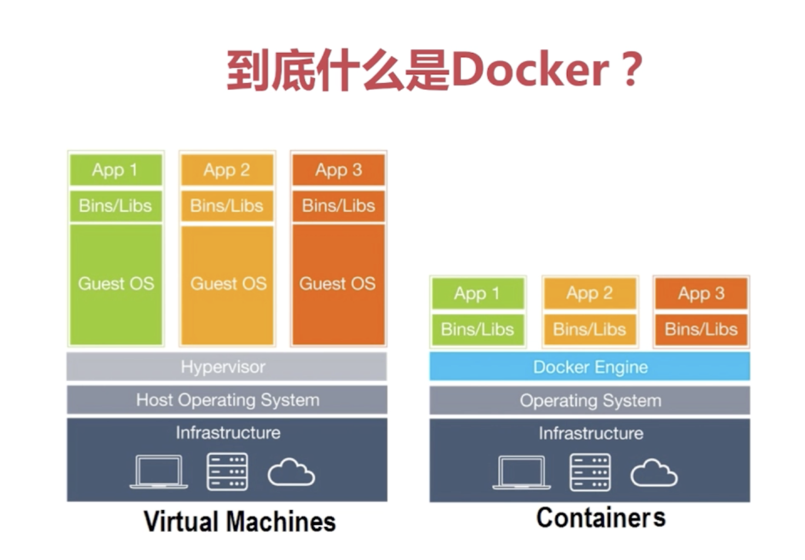
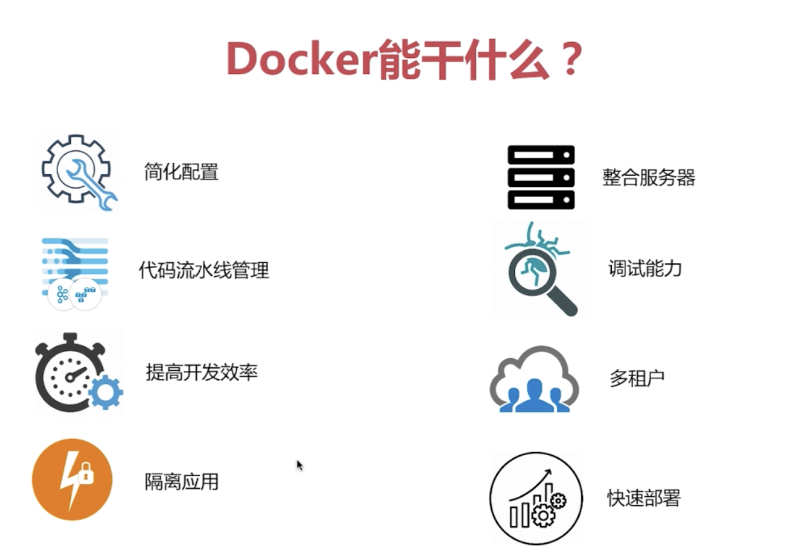
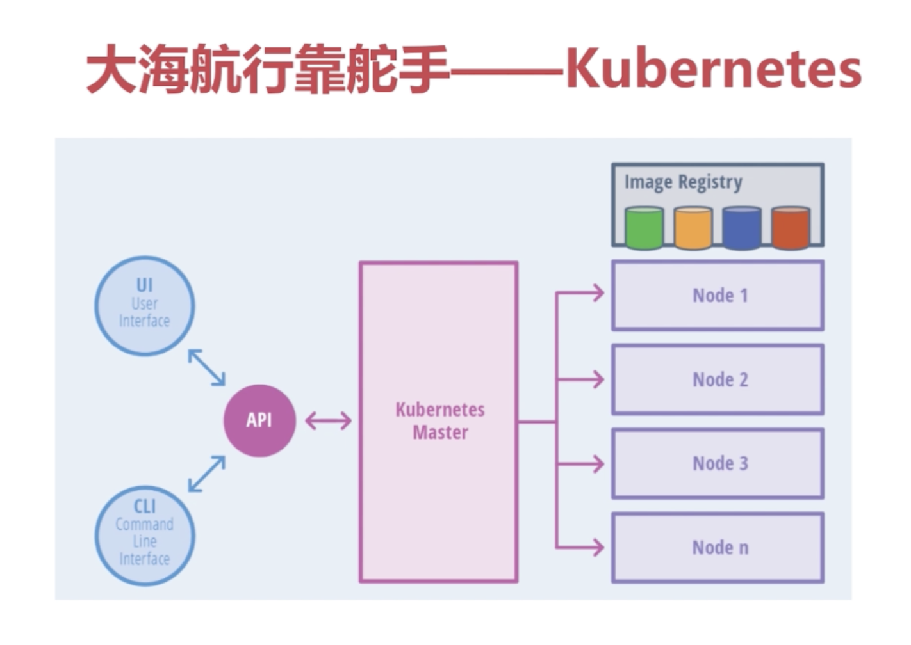
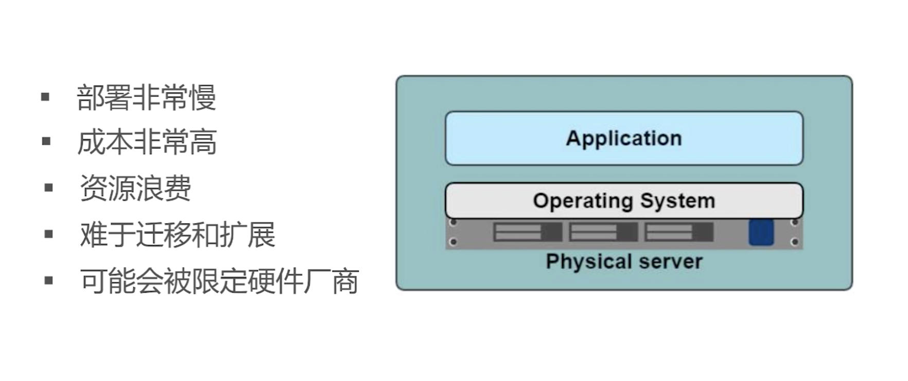
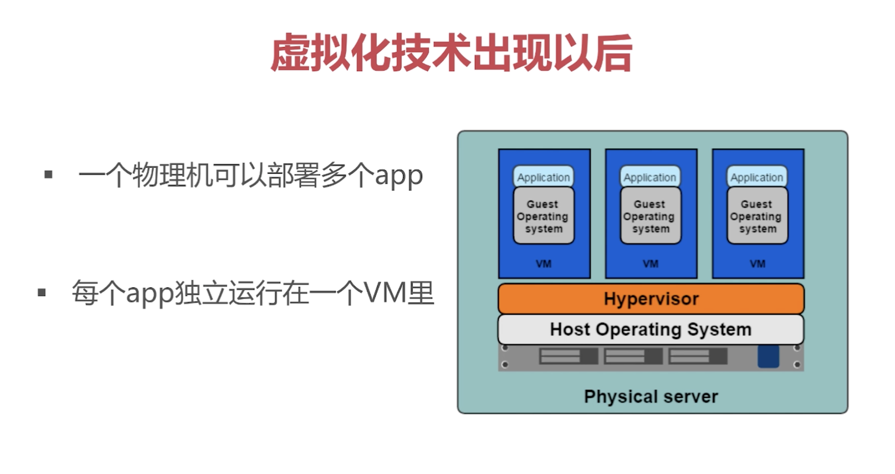
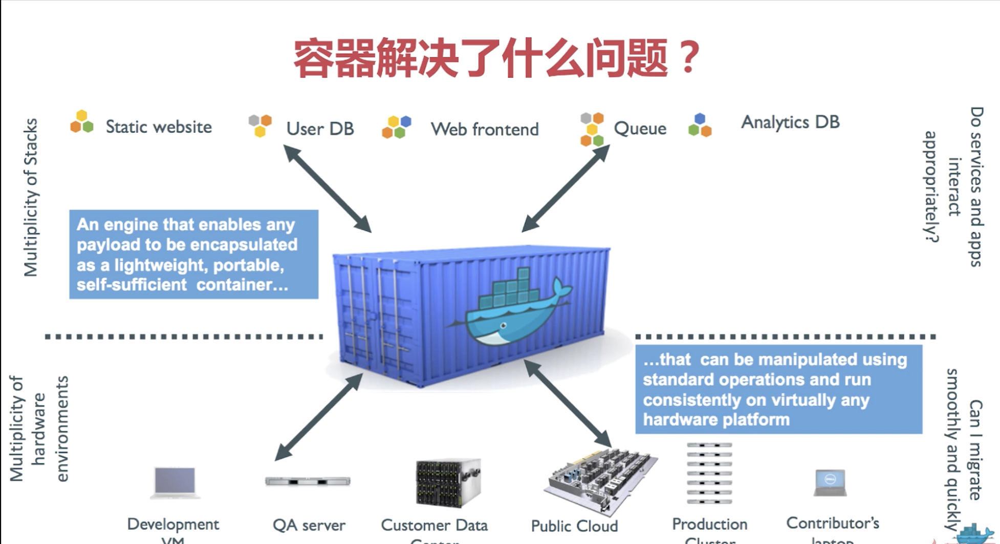

## Docker课程内容
* docker基本知识
* docker的安装，配置
* docker镜像
* docker network配置
* docker持久化存储
* docker-compose 容器部署
* docker registry配置，基础接口
* docker编排工具docker swarm(Kubernetes)
* 微服务概念
* 部署ELK
* 部署gitlab
* Docker + DevOps实战

## Docker导学
1. 什么是Docker <br>


2. Docker能干什么 <br>


3. Kubernetes <br>


4. 物理服务器 <br>


5. 虚拟化技术 <br>



3. docker <br>




## 安装和使用Docker

```bash
# step 1: 安装必要的一些系统工具
sudo yum install -y yum-utils device-mapper-persistent-data lvm2
# Step 2: 添加软件源信息
sudo yum-config-manager --add-repo http://mirrors.aliyun.com/docker-ce/linux/centos/docker-ce.repo
# Step 3: 更新并安装Docker-CE
sudo yum makecache fast
sudo yum -y install docker-ce

# Step 4: 配置镜像加速器
sudo mkdir -p /etc/docker
sudo tee /etc/docker/daemon.json <<-'EOF'
{
  "registry-mirrors": ["https://x5y5eu8z.mirror.aliyuncs.com"]
}
EOF
sudo systemctl daemon-reload
# Step 5: 设置docker自启动并运行docker
systemctl enable docker
systemctl start docker
```

## docker 基本命令

```bash
# 查看镜像列表
docker images

# 删除镜像
docker rmi

# 启动一个容器
docker run

# 停止一个容器
docker stop

# 运行一个被停止的容器
docker start

# 移除一个容器
docker rm

# 在运行的容器中执行命令
docker exec

# 查看容器运行日志
docker logs

# 查看容器的元数据
docker inspect

```

## 运行一个简单容器
```bash
docker run -d --name nginx -p 80:80 nginx
```
## 挂载卷
```bash
docker volume create nginx_content
docker run -d -v nginx_content:/usr/share/nginx/html -p 80:80 nginx
```

## docker网络

1. bridge
2. host
3. overlay

## 安装docker-compose

```
curl -L  https://github.com/docker/compose/releases/download/1.22.0/docker-compose-Linux-x86_64 -o /usr/local/bin/docker-compose
sudo chmod +x /usr/local/bin/docker-compose
```

## 使用Docker-compose 部署一个简单的wordpress网站
1. 在 /opt/app/wordpress 文件夹下新建docker-compose.yml 文件，内容如下：
```
version: '3'
services:
  wordpress:
    image: wordpress
    ports:
      - 80:80
    depends_on:
      - mysql
    environment:
      WORDPRESS_DB_HOST: mysql
      WORDPRESS_DB_PASSWORD: root
    networks:
      - my-bridge
  mysql:
    image: mysql:5.7
    environment:
      MYSQL_ROOT_PASSWORD: root
      MYSQL_DATABASE: wordpress
    volumes:
      - mysql-data:/var/lib/mysql
    networks:
      - my-bridge
volumes:
  mysql-data:
networks:
  my-bridge:
    driver: bridge
```
2. 在目录下执行
```
docker-compose up -d
```
3. 查看日志
```
docker-compose logs -f
```
4. 重启容器
```
docker-compose restart or docker-compose restart wordpress
```
5. 停止容器
```
docker-compose stop
```
6. 删除容器
```
docker-compose rm
```

## 安装和配置 docker registry

```bash
docker run -d -p 5000:5000 -v /data/docker-registry:/var/lib/registry --restart=always --name registry registry
```
*注意: 使用自己搭建的docker registry需要在docker daemo里添加insecure-registries配置*

## Docker swarm

* 初始化swarm
```
docker swarm init
```

### 查看节点
```
docker node ls
```

### 服务

#### 查看服务列表
```
docker service ls
```

#### 创建服务
```
docker service create --name nginx -p 80:80 nginx
```

### 查看服务运行节点
```
docker service ps nginx
```

## ELK